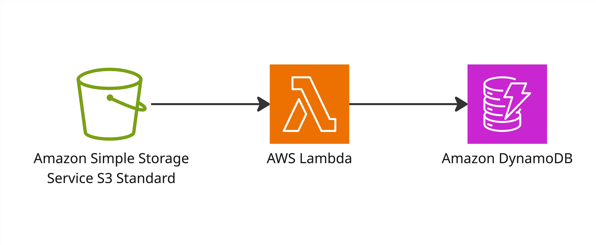

# Media Processor: Powered by AWS Serverless

A serverless application that automatically logs metadata of any file uploaded to an S3 bucket into a DynamoDB table. Built with AWS SAM, TypeScript, and Node.js 20.

## Architecture



The application follows a simple serverless architecture:

1. **Amazon S3** - Stores uploaded files and triggers the Lambda function on file creation
2. **AWS Lambda** - Processes S3 events and extracts file metadata
3. **Amazon DynamoDB** - Stores the file metadata (filename, bucket, size, timestamp)

## Project Structure

```
.
├── image-logger/           # Lambda function source code
│   ├── app.ts              # Main logic
│   └── package.json        # Dependencies (AWS SDK v3)
├── events/                 # Mock events for local testing
│   └── s3-event.json       # Generated S3 Put event
├── template.yaml           # SAM template (Infrastructure as Code)
└── env.json                # Local environment variables mapping
```

## Prerequisites

- AWS CLI configured with Administrator permissions.
- SAM CLI installed.
- Docker installed (for local testing).
- Node.js 20.x and esbuild installed globally (`npm install -g esbuild`).

## Getting Started

### 1. Installation

Install dependencies for the Lambda function:

```bash
cd image-logger
npm install
cd ..
```

### 2. Build the Application

The `sam build` command compiles the TypeScript code into a bundled JavaScript file using esbuild as defined in `template.yaml`.

```bash
sam build
```

### 3. Deploy to AWS

For the first deployment, use the guided mode to set your stack name and region:

```bash
sam deploy --guided
```

**Note:** After deployment, copy the Physical ID of the DynamoDB table from the AWS Console for local testing.

## Local Development & Testing

Since this project interacts with AWS services, we use a **Hybrid Local** approach where the code runs on your machine but communicates with the real DynamoDB table in the cloud.

### Step 1: Prepare Environment Variables

Create an `env.json` file in the root directory. Replace `YOUR_ACTUAL_TABLE_NAME` with the name found in your AWS Console.

```json
{
  "ImageProcessorFunction": {
    "TABLE_NAME": "YOUR_ACTUAL_TABLE_NAME"
  }
}
```

### Step 2: Invoke Locally

Run the function using a mock S3 event:

```bash
sam local invoke ImageProcessorFunction -e events/s3-event.json --env-vars env.json
```


## Clean Up

To remove all resources created by this project:

1. Empty the S3 bucket: `aws s3 rm s3://YOUR_BUCKET_NAME --recursive`
2. Delete the stack: `sam delete`
